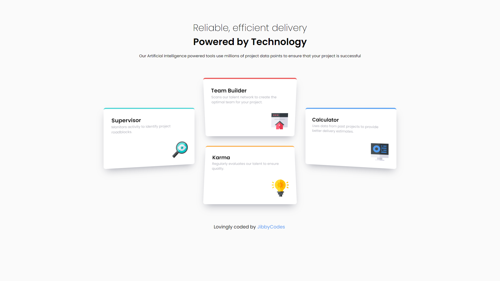
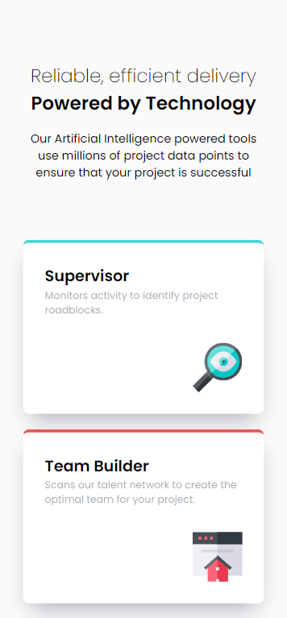

# Frontend Mentor - Four Card Feature Section

This is a solution to the [Interactive pricing component challenge on Frontend Mentor](https://www.frontendmentor.io/challenges/interactive-pricing-component-t0m8PIyY8). Frontend Mentor challenges help you improve your coding skills by building realistic projects.

## Table of contents

- [Overview](#overview)
  - [The challenge](#the-challenge)
  - [Screenshot](#screenshot)
  - [Links](#links)
- [My process](#my-process)
  - [Built with](#built-with)
  - [What I learned](#what-i-learned)
  - [Continued development](#continued-development)
  - [Useful resources](#useful-resources)
- [Author](#author)
- [Acknowledgments](#acknowledgments)

## Overview

### The challenge

Users should be able to:

- View the optimal layout for the app depending on their device's screen size
- See hover states for all interactive elements on the page
- Use the slider and toggle to see prices for different page view numbers

### Screenshot

### Links

- Solution URL: [https://github.com/Kijimai/four-card-feature-section-react](https://github.com/Kijimai/four-card-feature-section-react)
- Live Site URL: [https://four-feature-section-react.netlify.app/](https://four-feature-section-react.netlify.app/)

## My process

### Built with

- Semantic HTML5 markup
- SCSS
- Flexbox
- Mobile-first workflow
- [React](https://reactjs.org/) - JS library

### What I learned

I wanted to deviate from the figma design just slightly at the end of it to make it my own while also trying out new css properties like transform perspective and animation keyframes.
I initially started with css grid to align the card items but later changed it to flexbox instead to better match the original design.

### Continued development

I may want to do a version of this using css grid to get better practice with grid-template-columns and grid-template-rows.

### Useful resources

- [MDN](https://developer.mozilla.org/en-US/docs/Web/CSS/perspective)
- [Keyframes](https://developer.mozilla.org/en-US/docs/Web/CSS/@keyframes)

## Author

- Website - [JibbyCodes](https://jdbucog.com/)
- Frontend Mentor - [@Kijimai](https://www.frontendmentor.io/profile/Kijimai)

